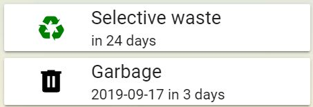
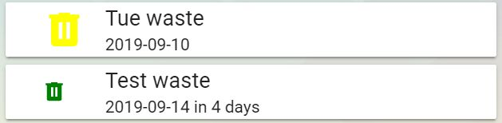

# Lovelace custom card for Garbage Collection

This Lovelace custom card displays garbage collection information provided by
the Garbage Collection custom component you may find at
[https://github.com/bruxy70/Garbage-Collection](https://github.com/bruxy70/Garbage-Collection/).<br />
It will draw your attention the day before the garbage collection by changing the icon color to red.

Lovelace UI does not support platform attributes natively.<br />
Implementation of handling attributes in Lovelace was inspired by [entity-attributes-card](https://github.com/custom-cards/entity-attributes-card).

#### Installation
The easiest way to install it is through [HACS (Home Assistant Community Store)](https://custom-components.github.io/hacs/),
search for <i>garbage</i> and select Garbage Collection Card from Plugins.<br />
If you are not using HACS, you may download garbage-collection-card.js and put it into homeassistant_config_dir/www.<br />

#### Lovelace UI configuration
Configuration parameters:<br />
<p>
**entity** (required): name of the sensor of garbage_collection platform.<br />
**due_color** (optional): icon color on day before and on due date. Accepts both color names and RGB values. Defaults to red.<br />
**icon_color** (optional): icon color. Accepts both color names and RGB values. Defaults to black.<br />
**icon_size** (optional): size of the icon. Defaults to 25px.<br />
**hide_date** (optional): hide date. Defaults to false.<br />
**hide_days** (optional): hide number of days. Defaults to false.<br />
**hide_before** (optional): hide entire card until x days before event.  Defaults to not hiding card.<br />
<p>
Please find below an example of ui-lovelace.yaml (entity should be the sensor of garbage_collection platform you defined):

```
resources:
  *When using HACS installation method
  - {type: module, url: '/community_plugin/garbage-collection-card/garbage-collection-card.js'}
  When using manual install method
  - {type: module, url: '/local/garbage-collection-card.js'}
    cards:
      - type: custom:garbage-collection-card
        entity: sensor.selective_waste
        icon_size: 35px
        icon_color: green
        hide_date: true
      - type: custom:garbage-collection-card
        entity: sensor.waste
        hide_before: 4
        icon_color: '#0561ba'
```

Normal card:<br />


Different icon sizes:<br />


